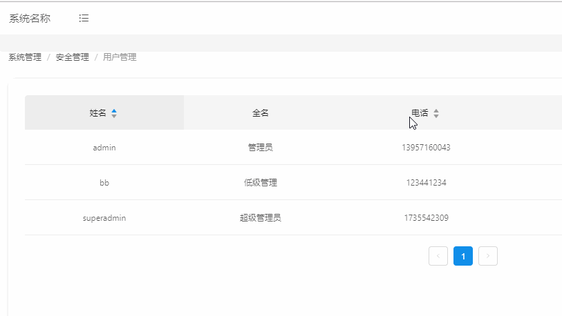

# firebrand-admin 快速上手

任务目标：建立第一个用户列表界面



### 添加接口配置

`utils/config` 添加配置

```javascript
api: {
    ...
    user: {
      users: `${MOCK_PFX}/users`,
      ...
    },
    ......
```

### 创建Service接口

由于user属于`系统管理-安全管理`下，我们将其放置到`manager/securityMgr/`模块下命名为`user.js`

`services/manager/securityMgr/user`

```javascript
//引用配置JS
import { request, config } from 'utils';
//对象的解构赋值
const { api:{ user:{ users:allUsers }} } = config

//创建异步函数
export async function query (params) {
  //通过request工具类调用post请求
  return request({
    url: allUsers,
    method: 'get',
    data: params,
  })
}
```

 ES6/ES7语法传送门

-   [对象的解构赋值](http://es6.ruanyifeng.com/#docs/destructuring#对象的解构赋值)
-   [异步函数](http://es6.ruanyifeng.com/#docs/async#语法)

### 创建接口Mock数据

`mock/users.js`

-   按照Mock.js规范([不懂点我](https://github.com/nuysoft/Mock/wiki))添加数据源信息

```javascript
let usersListData = Mock.mock({
  'data|30-40': [
    {
      id: '@id',
      username: '@last',
      fullname: '@name',
      phone: /^1[34578]\d{9}$/,
      enabled: 1,
      'age|11-99': 1,
      ....
```

-   创建查询mock拦截以及返回结果

```javascript
[`GET ${apiPrefix}/users`] (req, res) {
    const { query } = req
    let { pageSize, page, ...other } = query
    pageSize = pageSize || 10
    page = page || 1
    ......
    res.status(200).json({
      data: {
        content: newData.slice((page - 1) * pageSize, page * pageSize),
        totalElements: newData.length,
      },
      code: 1000
    })
  }
```

### 创建models

流程简介： 模型启动后会触发地址变换事件(subscription)，触发查询query异步调用(effect)，异步加载数据完成后如果有数据会触发querySuccess(reducer)方法进而改变state,state改变会自动刷新模型绑定的route components达到界面刷新

```javascript
import modelExtend from 'dva-model-extend'
import { query } from 'services/manager/securityMgr/user';
import { pageModel } from 'models/common/common'
import { config } from 'utils'
const { prefix } = config

//从models/commmon/common/pageModel继承模型
export default modelExtend(pageModel, {
  //模型命名空间
  namespace: 'user',
  //模型初始化状态，由于参数已经在`models/common/common.js`中设置过了，这里不需要设置
  state: {
  },
  //创建订阅方法
  subscriptions:{
    //启动时监听
    setup ({ dispatch, history }) {
      // 监听当前的地址变换,这里使用 箭头函数
      history.listen(location => {
        //触发查询effect
        dispatch({
          type: `query`,
          payload: {page: 1}
        });
      })
    },
  },
  //异步操作调用函数模块，这里需要创建的是 Generator函数
  effects: {
    *query ({ payload = {} }, { call, put }) {
      //异步调用query方法
      const data = yield call(query, payload)
      if (data && data.code == 1000) {
        //调用querySuccess的reducer
        yield put({
          type: 'querySuccess',
          payload: {
            list: data.data.content,
            pagination: {
              current: Number(payload.page) || 1,
              pageSize: Number(payload.pageSize) || 10,
              total: data.data.totalElements,
            }
          },
        });
      }
    },
  },
  //reducer已经在pageModel中实现过了，这里就不用写querySuccess了
  reducers:{},
})
```

源码参考
`models/common/common.js`

```javascript
import modelExtend from 'dva-model-extend'

const model = {
  reducers: {
    updateState (state, { payload }) {
      return {
        ...state,
        ...payload,
      }
    },
  },
}

const pageModel = modelExtend(model, {
  state: {
    list: [],
    pagination: {
      showSizeChanger: true,
      showQuickJumper: true,
      showTotal: total => `Total ${total} Items`,
      current: 1,
      total: 0,
    },
  },

  reducers: {
    querySuccess (state, { payload }) {
      const { list, pagination } = payload
      return {
        ...state,
        list,
        pagination: {
          ...state.pagination,
          ...pagination,
        },
      }
    },
  },
})

module.exports = {
  model,
  pageModel,
}
```

ES6/ES7语法传送门

-   [函数默认值](http://es6.ruanyifeng.com/#docs/function#函数参数的默认值)
-   [函数参数的结构赋值](http://es6.ruanyifeng.com/#docs/function#函数参数的默认值)
-   [箭头函数](http://es6.ruanyifeng.com/#docs/function#箭头函数)
-   [Generator 函数](http://es6.ruanyifeng.com/#docs/generator)

## Route Component创建

创建`routes/manager/securityMgr/user/index.js`用来展示数据

```javascript
import React from 'react';
import { connect } from 'dva';
import { Table } from 'antd';

const Users = function ({ location, dispatch, user, loading }) {
  //字段名
  const columns = [{
    title: '姓名',
    dataIndex: 'username',
    key: 'username',
    sorter: true,
  },
  ......
   {
    title: '住址',
    dataIndex: 'address',
    key: 'address',
  }];
  //为item增加key指标，指标值为item.id
  const dataSource = user.list.map(item => {
    item.key = item.id;
    return item;
  }) ;

  const onChange = (pagination, filters, sorter) => {
    //调用user模型下的query方法，异步获取数据，传入参数sort名称
    dispatch({
      type: 'user/query',
      payload: {
        sort:sorter.field
      }
    })
  }
  const tableProps = {
    dataSource,
    columns,
    loading: loading.effects['user/query'],
    onChange
  }
  //JSX语法
  return (
    <div className="content-inner">
      <Table { ...tableProps } />
    </div>
  )
}
//参数校验，确定输入参数类型
Users.propTypes = {
  location: React.PropTypes.object.isRequired,
  dispatch: React.PropTypes.func.isRequired,
  user: React.PropTypes.object.isRequired,
  loading: React.PropTypes.object.isRequired,
}

export default connect(({user, loading}) => ({user, loading}))(Users)
```

传送门
[Antd 模型](https://ant.design/components/button-cn/)
[React JSX简介](https://doc.react-china.org/docs/introducing-jsx.html)

## 增加React路由

`router.js`中增加路由映射关系

```javascript
 const routes = [
   ...
   {
     path: '/user',
       //模型路径配置到js文件
       models: () => [import('models/manager/securityMgr/user')],
       //route component路径配置到文件夹
       component: () => import('routes/manager/securityMgr/user/'),
   },
]
```

## 数据库增加资源和用户角色关联关系

10.8.132.242:3306/firebrand 数据库中改 sys_role sys_resource sys_roleresource表

## 系统数据维护数据调用

-   方法一，model继承configModel

启动时调用 Action `queryDefConfig`，系统维护数据自动放于该模型`state:defConfig`中，可直接使用

```javascript
export default modelExtend(configModel, {
  subscriptions: {
    setup ({ dispatch }) {
      dispatch({type: 'queryDefConfig', payload: {force: true}})
    }
  }
}
```

-   方法二，直接调用-传入回调函数
    此方法不推荐，最后获取的数据需要自己调用reducer传入state中使用

```javascript
import { getSystemConfig } from 'utils/sysconfig'

/**
 * @param callbackFn {Func} 访问成功回调函数
 * @param name 回调函数参数项  null为所有
 * @param force 是否强制刷新 null不刷新
 */
getSystemConfig(function (data) {
  console.log(`数据 ${JSON.stringify(data)}`)
}, name, force);
```
